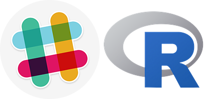

<!-- README.md is generated from README.Rmd. Please edit that file -->
[](http://cran.r-project.org/web/packages/slackr)



`slackr` - a package to send user messages & webhook API messages to Slack channels/users

The `slackr` package contains functions that make it possible to interact with the Slack messaging platform. When you need to share information/data from R, rather than resort to copy/paste in e-mails or other services like Skype, you can use this package to send well-formatted output from multiple R objects and expressions to all teammates at the same time with little effort. You can also send images from the current graphics device, R objects (as R data files), and upload files.

### BREAKING CHANGES

Versions 1.4+ BREAK THINGS.

Support has been removed for the "old style" incoming web hooks (see "Setup" below for the required incoming web hook URL format).

The incoming webhook "token" is no longer required or used.

### News

-   Version `1.4.0.9000` new `slackr_msg()` + many fixes and BREAKING CHANGES (see above)
-   Version `1.3.1.9000` Removed `data.table` dependency (replaced with `dplyr`); added access to `im.list` (<https://api.slack.com/methods/im.list>) thx to PR from Quinn Weber
-   Version `1.3.0.9000` Radically changed how `slackr` works. Functions have camelCase and under\_score versions
-   Version `1.2.3` added more parameter error checking, removed the need for ending `?` on webhook URL and added defaults for missing setup parameters.
-   Version `1.2.2` fixed [issue](https://github.com/hrbrmstr/slackr/issues/4) (bug in `1.2.1` fix)
-   Version `1.2.1` fixed [issue](https://github.com/hrbrmstr/slackr/issues/3) when there are no private groups defined
-   Version `1.2` re-introduced `ggslackr()` (first [CRAN version](http://cran.at.r-project.org/web/packages/slackr/index.html))
-   Version `1.1.1` fixed a bug in the new full API `slackr()` function
-   Version `1.1` added graphics & files capability
-   Version `1.0` released

Many thanks to:

-   [Jay Jacobs](https://github.com/jayjacobs)
-   [David Severski](https://github.com/davidski)
-   [Quinn Weber](https://github.com/qsweber)
-   [Konrad Karczewski](https://github.com/konradjk)
-   [Ed Niles](https://github.com/eniles)
-   [Rick Saporta](https://github.com/rsaporta)

for their contributions to the package!

The following functions are implemented:

-   `slackr_setup` : initialize necessary environment variables
-   `slackr` : send stuff to Slack
-   `slackr_bot` : send stuff to Slack using an incoming webhook URL
-   `dev_slackr` : send the graphics contents of the current device to a to Slack channel
-   `ggslackr` : send a ggplot object to a Slack channel (no existing device plot required, useful for scripts)
-   `save_slackr` : save R objects to an RData file on Slack
-   `slackr_upload` : upload any file to Slack
-   `slackr_users` : get a data frame of Slack
-   `slackr_channels` : get a data frame of Slack
-   `slackr_groups` : get a data frame of Slack groups
-   `text_slackr` : Send regular or preformatted messages to Slack
-   `slackr_msg` : Slightly different version of `text_slackr()`

### SETUP

The `slackr_setup()` function will try to read setup values from a `~/.slackr` (you can change the default) configuration file, which may be easier and more secure than passing them in manually (plus, will allow you to have multiple slackr configs for multiple Slack.com teams). The file is in Debian Control File (DCF) format since it really doesn't need to be JSON and R has a handy `read.dcf()` function since that's what `DESCRIPTION` files are coded in. Here's the basic format for the configuration file:

    api_token: YOUR_FULL_API_TOKEN
    channel: #general
    username: slackr
    incoming_webhook_url: https://hooks.slack.com/services/XXXXX/XXXXX/XXXXX

You can also change the default emoji icon (from the one you setup at integration creation time) with `icon_emoji`.

### Installation

``` r
# stable/CRAN
install.packages("slackr")

# bleeding edge
devtools::install_github("hrbrmstr/slackr")
```

### Usage

``` r
library(slackr)

# current verison
packageVersion("slackr")
#> [1] '1.4.1.9000'
```

``` r
slackrSetup(channel="#code", 
            incoming_webhook_url="https://hooks.slack.com/services/XXXXX/XXXXX/XXXXX")

slackr(str(iris))

# send images
library(ggplot2)
qplot(mpg, wt, data=mtcars)
dev.slackr("#results")

barplot(VADeaths)
dev.slackr("@jayjacobs")

ggslackr(qplot(mpg, wt, data=mtcars))
```

### Test Results

``` r
library(slackr)
library(testthat)

date()
#> [1] "Mon Feb 15 08:37:19 2016"

test_dir("tests/")
#> testthat results ========================================================================================================
#> OK: 0 SKIPPED: 0 FAILED: 0
```
